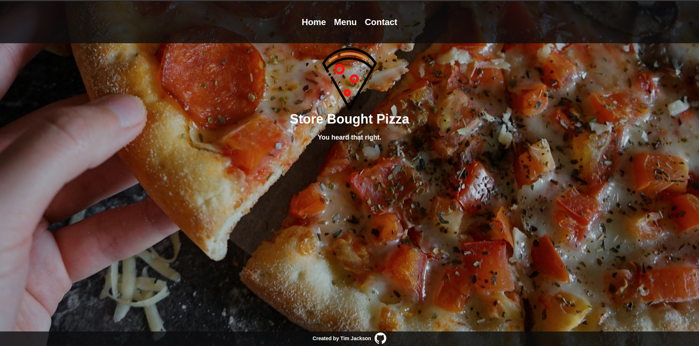
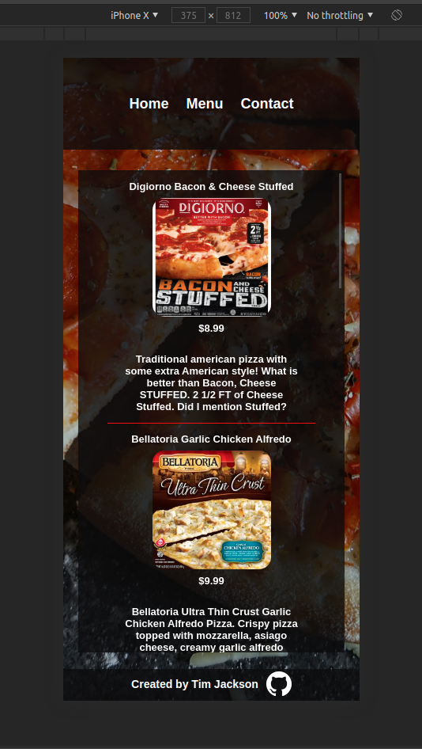
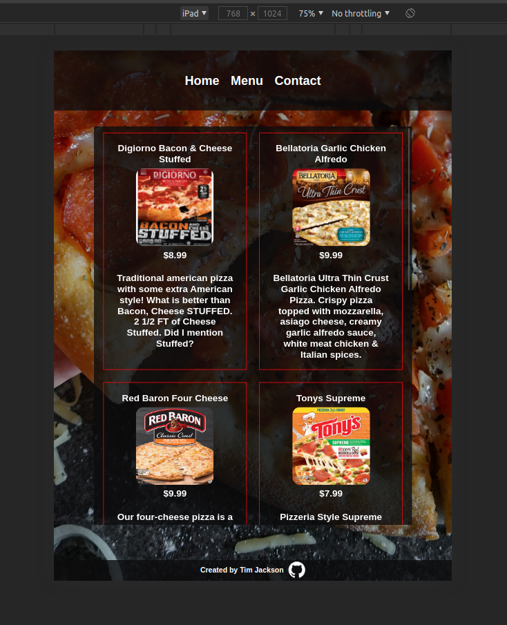

<h1 align="center">
   
  Restuarant-Page
   
  <image src="dist/images/logo9.svg" width="150px"> 
</h1>

<h4 align="center">Not your local restaurant - located in Tuvalu. Project created with HTML, CSS, Javascript.</h4>

  <a href="#screenshots">Screenshots</a> •
  <a href="#goals">Goals</a> •
  <a href="#summary">Summary</a> •
  <a href="#author">Author</a> •
    <a href="#credits">Credits</a> •
  <a href="#license">License</a>

### ✨ [Live Demo](https://timjacksonm.github.io/Restaurant-Page)
## Screenshots

  
Show Image

  
  
  
  The next two photos show responsive web design implementation for Iphone and Ipad.
  
  
  

## Goals:
- [✔️] Start by using npm and install webpack into my project!
- [✔️] Create a bare-bones homepage for a restaurant.
- [✔️] Set up your restaurant page to use tabbed browsing.
- [✔️] Add a "Contact us" & "Menu" Page to the tabs.

**Optional Extra Credit**
- [] Add an interactive map to the contact page.

**View Commits on project to see changes**

## Summary

This projects focus was implementing ES6 Modules and practicing DOM manipulation by dynamically rendering a simple restaurant homepage. I enjoyed working with ES6 Modules as it made my code easier to read. FYI Bellatoria is the best pizza you can buy at my restaurant in my opinion (choices are slim). Enjoy!

## Author

👤 **Tim Jackson**

- Github: [@timjacksonm](https://github.com/timjacksonm)
- Twitter [@timjacksonm](https://twitter.com/timjacksonm)
- LinkedIn [@timjacksonm](https://linkedin.com/in/timjacksonm)

## Credits

This project idea was a part of my studies at The Odin Project's curriculum. You can see the lesson <a href="https://www.theodinproject.com/paths/full-stack-javascript/courses/javascript/lessons/restaurant-page" target="_blank">here</a>!

## License

  <a href="https://choosealicense.com/licenses/mit/">
    

